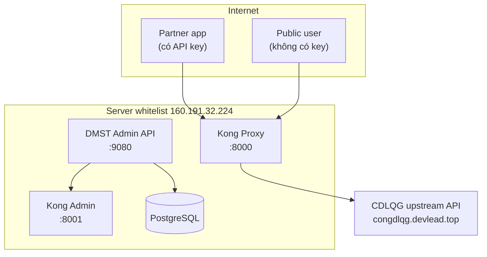
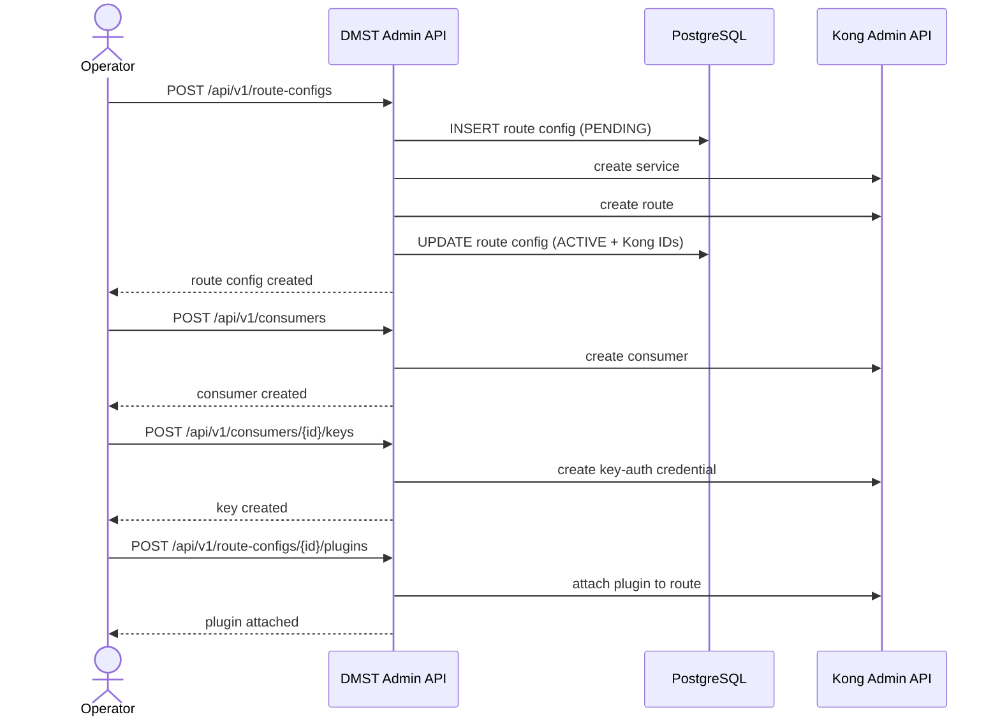
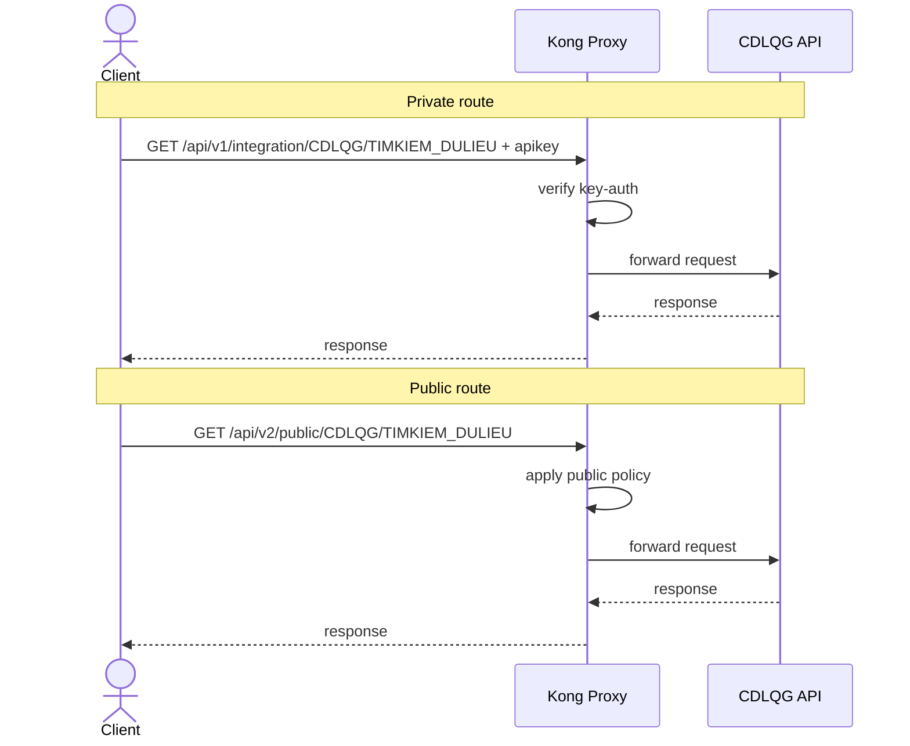
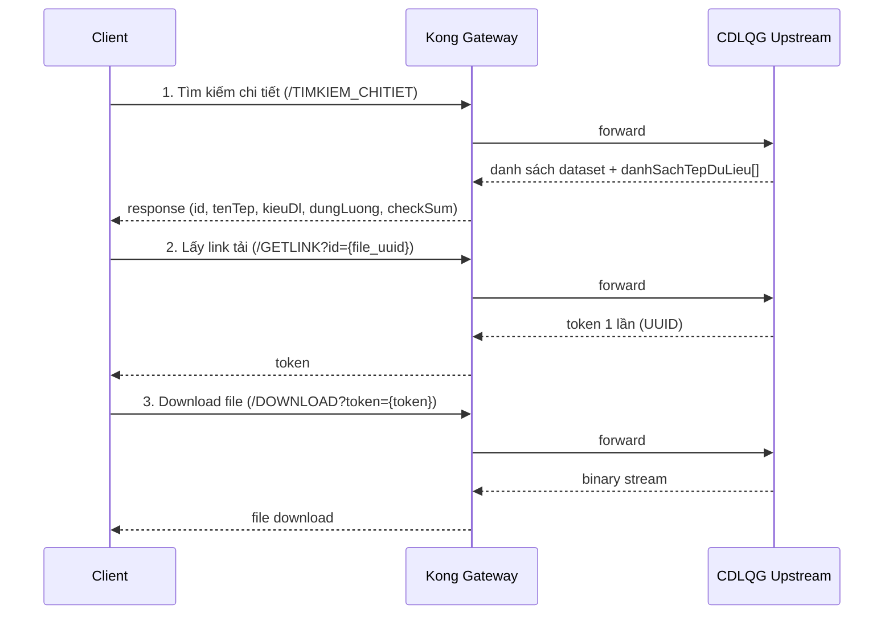

# Hướng dẫn demo publish API qua Kong bằng curl

> **Mục tiêu:** Demo đầy đủ bài toán publish một API nguồn chỉ cho phép truy cập từ server whitelist ra ngoài internet thông qua Kong Gateway, đồng thời thể hiện các chức năng quản trị đã có trong DMST Admin API: tạo route config, tạo consumer, cấp API key, gắn plugin, xem danh sách, xem chi tiết, cập nhật, xem history, rollback và xóa cấu hình.

---

## 1. Bài toán product

### Bối cảnh
- API nguồn `congdlqg.devlead.top` chỉ cho phép truy cập từ server whitelist.
- Người dùng hoặc đối tác bên ngoài không thể gọi trực tiếp API nguồn.
- Cần một lớp trung gian để:
  - publish API ra ngoài internet
  - kiểm soát truy cập theo từng nhóm người dùng
  - quản trị tập trung qua Admin API thay vì cấu hình tay trên Kong

### 3 nhóm người dùng trong demo
- **Operator/Admin**: tạo cấu hình publish API và chính sách truy cập.
- **Partner tích hợp**: gọi endpoint có bảo vệ bằng API key.
- **Người dùng public**: gọi endpoint công khai.

### Kết quả mong muốn
Từ một upstream duy nhất, hệ thống publish thành 2 endpoint:
- **Private integration route**: yêu cầu API key.
- **Public route**: không yêu cầu key; nếu muốn demo rate limit thì phải verify thêm cấu hình plugin ở môi trường thực tế.

---

## 2. Kiến trúc tổng quan



### Ý chính cần hiểu
- **DMST Admin API** là lớp quản trị cấu hình publish API.
- **Kong Gateway** là lớp runtime thực thi routing và plugin.
- **PostgreSQL** lưu metadata, trạng thái và lịch sử thay đổi.
- Operator không cần cấu hình trực tiếp trên Kong để publish API.

---

## 3. Luồng hoạt động

### 3.1. Luồng quản trị



### 3.2. Luồng runtime



---

## 4. Phạm vi demo

### 4.1. Quản trị publish API
- tạo route config
- xem danh sách route config
- xem chi tiết route config
- cập nhật upstream
- xem history
- rollback
- xóa route config

### 4.2. Quản trị xác thực
- tạo consumer
- cấp API key
- gắn plugin `key-auth`

### 4.3. Kiểm chứng runtime
- private route không có key → `401`
- private route có key → `200`
- public route → `200`
- public route vượt ngưỡng → `429` nếu plugin rate limiting thực sự được cấu hình thành công trên Kong

---

## 5. Pre-flight checklist

### 5.1. Endpoint hệ thống

| Thành phần | Địa chỉ |
|---|---|
| Admin API | `http://160.191.32.224:9080` |
| Kong Proxy | `http://160.191.32.224:8000` |
| Kong Admin | `http://160.191.32.224:8001` |

### 5.2. Biến dùng chung

```bash
export ADMIN_API_BASE="http://160.191.32.224:9080/api/v1"
export KONG_PROXY_BASE="http://160.191.32.224:8000"
export KONG_ADMIN_BASE="http://160.191.32.224:8001"

export SYSTEM_CODE="CDLQG"
export ACTION_CODE="TIMKIEM_DULIEU"
export UPSTREAM_URL="https://congdlqg.devlead.top/api/nguoidan/ud-tap-du-lieu/tim-kiem"
export PARTNER_USERNAME="cdlqg-partner-01"
export PARTNER_API_KEY="cdlqg-secret-key-2026"
```

### 5.3. Health check cơ bản

```bash
curl -i http://160.191.32.224:9080/health
curl -i http://160.191.32.224:8000
curl -i http://160.191.32.224:8001
```

### 5.4. Các điều kiện phải xác nhận trước
- Admin API đang kết nối được PostgreSQL.
- Admin API đang kết nối được Kong Admin API.
- Upstream `congdlqg.devlead.top` còn reachable từ server whitelist.
- Các bảng `kong_route_configs`, `kong_route_config_history`, `kong_consumers`, `kong_consumer_keys`, `kong_route_plugins` đã tồn tại.

---

## 6. Quy ước route path

```text
/api/{version}/{app}/{SYSTEM_CODE}/{ACTION_CODE}
```

| Trường hợp | version | app | Route path |
|---|---|---|---|
| Private integration | `v1` | `integration` | `/api/v1/integration/CDLQG/TIMKIEM_DULIEU` |
| Public | `v2` | `public` | `/api/v2/public/CDLQG/TIMKIEM_DULIEU` |

---

## 7. Demo private integration route

## 7.1. Tạo route config private

```bash
curl -X POST "$ADMIN_API_BASE/route-configs" \
  -H "Content-Type: application/json" \
  -d '{
    "system_code": "CDLQG",
    "action_code": "TIMKIEM_DULIEU",
    "version": "v1",
    "app": "integration",
    "upstream_url": "https://congdlqg.devlead.top/api/nguoidan/ud-tap-du-lieu/tim-kiem",
    "strip_path": true
  }'
```

### Kỳ vọng
- HTTP `201 Created`
- Response có `id`, `route_path`, `status`, `kong_service_id`, `kong_route_id`

```bash
export PRIVATE_ROUTE_ID="<uuid-private-route-config>"
```

---

## 7.2. Xem danh sách route config

```bash
curl "$ADMIN_API_BASE/route-configs"
```

---

## 7.3. Xem chi tiết route config private

```bash
curl "$ADMIN_API_BASE/route-configs/$PRIVATE_ROUTE_ID"
```

### Cần kiểm tra
- `system_code`
- `action_code`
- `version`
- `app`
- `route_path`
- `upstream_url`
- `status=ACTIVE`

---

## 7.4. Tạo consumer cho partner

```bash
curl -X POST "$ADMIN_API_BASE/consumers" \
  -H "Content-Type: application/json" \
  -d '{
    "username": "cdlqg-partner-01"
  }'
```

```bash
export CONSUMER_ID="<uuid-consumer>"
```

---

## 7.5. Cấp API key cho consumer

```bash
curl -X POST "$ADMIN_API_BASE/consumers/$CONSUMER_ID/keys" \
  -H "Content-Type: application/json" \
  -d '{
    "key": "cdlqg-secret-key-2026"
  }'
```

---

## 7.6. Gắn plugin `key-auth` cho private route

```bash
curl -X POST "$ADMIN_API_BASE/route-configs/$PRIVATE_ROUTE_ID/plugins" \
  -H "Content-Type: application/json" \
  -d '{
    "plugin_name": "key-auth"
  }'
```

---

## 7.7. Verify runtime cho private route

### Không có key

```bash
curl -i "$KONG_PROXY_BASE/api/v1/integration/CDLQG/TIMKIEM_DULIEU?Keyword=&Page=1&Size=5"
```

**Kỳ vọng:** `401 Unauthorized`

### Có key hợp lệ

```bash
curl -i "$KONG_PROXY_BASE/api/v1/integration/CDLQG/TIMKIEM_DULIEU?Keyword=&Page=1&Size=5" \
  -H "apikey: $PARTNER_API_KEY"
```

**Kỳ vọng:** `200 OK`

---

## 8. Demo public route

## 8.1. Tạo route config public

```bash
curl -X POST "$ADMIN_API_BASE/route-configs" \
  -H "Content-Type: application/json" \
  -d '{
    "system_code": "CDLQG",
    "action_code": "TIMKIEM_DULIEU",
    "version": "v2",
    "app": "public",
    "upstream_url": "https://congdlqg.devlead.top/api/nguoidan/ud-tap-du-lieu/tim-kiem",
    "strip_path": true
  }'
```

```bash
export PUBLIC_ROUTE_ID="<uuid-public-route-config>"
```

---

## 8.2. Gắn plugin public policy

### Trạng thái thực tế của code hiện tại
Hiện tại endpoint gắn plugin chỉ xác nhận chắc chắn hỗ trợ payload dạng:

```json
{
  "plugin_name": "..."
}
```

### Demo attach plugin `rate-limiting`

```bash
curl -X POST "$ADMIN_API_BASE/route-configs/$PUBLIC_ROUTE_ID/plugins" \
  -H "Content-Type: application/json" \
  -d '{
    "plugin_name": "rate-limiting",
    "config": {
      "minute": 5,
      "policy": "local"
    }
  }'
```

### Cảnh báo quan trọng
- Lệnh trên sẽ gắn plugin `rate-limiting` và cấu hình giới hạn **5 request/phút**.
- Nhờ có cập nhật API Go hỗ trợ chuyển tiếp cấu hình, bạn có thể gửi bất kỳ key config nào mà plugin Kong yêu cầu.


---

## 8.3. Verify runtime cho public route

```bash
curl -i "$KONG_PROXY_BASE/api/v2/public/CDLQG/TIMKIEM_DULIEU?Keyword=&Page=1&Size=5"
```

**Kỳ vọng tối thiểu:** `200 OK`

### Verify rate limit
Chỉ chạy bước này nếu đã xác nhận plugin `rate-limiting` trên Kong có cấu hình phù hợp.

```bash
for i in $(seq 1 6); do
  printf 'request %s -> ' "$i"
  curl -s -o /dev/null -w '%{http_code}\n' \
    "$KONG_PROXY_BASE/api/v2/public/CDLQG/TIMKIEM_DULIEU?Page=1&Size=1"
  sleep 1
done
```

**Kỳ vọng có điều kiện:** nếu policy đã cấu hình đúng thì request vượt ngưỡng trả `429`.

---

## 9. Demo các chức năng quản trị còn lại

## 9.1. Cập nhật upstream của route config

```bash
curl -X PUT "$ADMIN_API_BASE/route-configs/$PUBLIC_ROUTE_ID" \
  -H "Content-Type: application/json" \
  -d '{
    "upstream_url": "https://congdlqg.devlead.top/api/nguoidan/ud-tap-du-lieu/tim-kiem"
  }'
```

---

## 9.2. Xem history của route config

```bash
curl "$ADMIN_API_BASE/route-configs/$PUBLIC_ROUTE_ID/history"
```

---

## 9.3. Rollback route config

```bash
curl -X POST "$ADMIN_API_BASE/route-configs/$PUBLIC_ROUTE_ID/rollback"
```

---

## 9.4. Xóa route config

```bash
curl -X DELETE "$ADMIN_API_BASE/route-configs/$PRIVATE_ROUTE_ID"
curl -X DELETE "$ADMIN_API_BASE/route-configs/$PUBLIC_ROUTE_ID"
```

---

## 10. Verification matrix

| Kịch bản | Kỳ vọng |
|---|---|
| Tạo route config private | `201`, có `id`, `route_path`, `status` |
| Xem list route configs | nhìn thấy private/public route |
| Xem detail route config | thấy `upstream_url`, `route_path`, `status`, Kong IDs |
| Tạo consumer | `201`, có consumer ID |
| Cấp key cho consumer | `201`, key được tạo |
| Gắn `key-auth` | `201`, plugin attach thành công |
| Private route không key | `401` |
| Private route có key | `200` |
| Tạo public route | `201`, có route ID |
| Gắn `rate-limiting` | attach plugin thành công ở mức `plugin_name` |
| Public route bình thường | `200` |
| Public route vượt ngưỡng | `429` nếu policy đã được verify trên Kong |
| Update route config | `200`, upstream đổi thành công |
| Xem history | có bản ghi lịch sử |
| Rollback route config | `200`, route quay về version trước |
| Delete route config | route config bị xóa thành công |

---

## 11. Lỗi thường gặp và cách hiểu đúng

### 11.1. Tạo route config thành công nhưng gọi proxy không ra dữ liệu
- upstream không reachable từ server whitelist
- route path gọi sai
- query string không đúng format upstream cần

### 11.2. Private route luôn trả `401`
- chưa gắn `key-auth`
- header không phải `apikey`
- key chưa được cấp đúng consumer

### 11.3. Public route không trả `429`
Trước hết kiểm tra:
- plugin `rate-limiting` có thực sự được attach trên Kong chưa
- môi trường Kong có policy/ngưỡng cụ thể chưa
- admin API hiện tại có forward plugin config đầy đủ hay không

### 11.4. Không nên oversell phần plugin config
Guide này chỉ xem là đã xác nhận trong code phần attach plugin theo `plugin_name`. Cấu hình chi tiết của plugin, đặc biệt với `rate-limiting`, phải verify riêng trên môi trường thực tế trước khi demo với product.

---

## 13. Kịch bản bổ sung: Đăng ký các API Kho Dữ Liệu Mở (CDLQG)

Mô tả luồng tải file từ Kho DL Mở:



### 13.1. Tạo Route Config — Tìm Kiếm Chi Tiết

```bash
curl -X POST "$ADMIN_API_BASE/route-configs" \
  -H "Content-Type: application/json" \
  -d '{
    "system_code": "CDLQG",
    "action_code": "TIMKIEM_CHITIET",
    "version": "v1",
    "app": "integration",
    "upstream_url": "https://congdlqg.devlead.top/api/nguoidan/ud-tap-du-lieu/tim-kiem-chi-tiet",
    "strip_path": true
  }'
```

```bash
export DETAIL_ROUTE_ID="<uuid-vừa-trả-về>"
```

### 13.2. Tạo Route Config — Get Link tải file

```bash
curl -X POST "$ADMIN_API_BASE/route-configs" \
  -H "Content-Type: application/json" \
  -d '{
    "system_code": "CDLQG",
    "action_code": "GETLINK",
    "version": "v1",
    "app": "integration",
    "upstream_url": "https://congdlqg.devlead.top/api/download/api/get-link",
    "strip_path": true
  }'
```

```bash
export GETLINK_ROUTE_ID="<uuid-vừa-trả-về>"
```

### 13.3. Tạo Route Config — Download file

```bash
curl -X POST "$ADMIN_API_BASE/route-configs" \
  -H "Content-Type: application/json" \
  -d '{
    "system_code": "CDLQG",
    "action_code": "DOWNLOAD",
    "version": "v1",
    "app": "integration",
    "upstream_url": "https://congdlqg.devlead.top/api/download/api/download-public",
    "strip_path": true
  }'
```

```bash
export DOWNLOAD_ROUTE_ID="<uuid-vừa-trả-về>"
```

### 13.4. Gắn plugin `key-auth` cho cả 3 endpoint

```bash
# Gắn key-auth cho Tìm Kiếm Chi Tiết
curl -X POST "$ADMIN_API_BASE/route-configs/$DETAIL_ROUTE_ID/plugins" \
  -H "Content-Type: application/json" \
  -d '{"plugin_name": "key-auth"}'

# Gắn key-auth cho Get Link
curl -X POST "$ADMIN_API_BASE/route-configs/$GETLINK_ROUTE_ID/plugins" \
  -H "Content-Type: application/json" \
  -d '{"plugin_name": "key-auth"}'

# Gắn key-auth cho Download
curl -X POST "$ADMIN_API_BASE/route-configs/$DOWNLOAD_ROUTE_ID/plugins" \
  -H "Content-Type: application/json" \
  -d '{"plugin_name": "key-auth"}'
```

### 13.5. Kiểm tra luồng tải file end-to-end

#### Bước 1: Tìm kiếm chi tiết
```bash
curl -s 'http://160.191.32.224:8000/api/v1/integration/CDLQG/TIMKIEM_CHITIET?page=1&size=2' \
  -H 'accept: application/json' \
  -H 'apikey: cdlqg-secret-key-2026'

# Do dữ liệu fake có thể không có file nên phải tìm đúng dataset có file 
curl -s 'http://160.191.32.224:8000/api/v1/integration/CDLQG/TIMKIEM_CHITIET?page=1&size=1&id=01be9ba4-7091-4756-908b-393374f33604' \
  -H 'accept: application/json' \
  -H 'apikey: cdlqg-secret-key-2026'

```
*Kỳ vọng:* `200 OK` — response chứa `danhSachTepDuLieu[]` với `id`, `tenTep`, `kieuDl`, `dungLuong`, `checkSum`.

```bash
export FILE_UUID="<id-của-file-cần-tải>"
```

#### Bước 2: Lấy link tải (token 1 lần)
```bash
curl -s "http://160.191.32.224:8000/api/v1/integration/CDLQG/GETLINK?id=$FILE_UUID" \
  -H 'accept: application/json' \
  -H 'apikey: cdlqg-secret-key-2026'
```
*Kỳ vọng:* `200 OK` — response chứa token UUID dùng 1 lần.

```bash
export DOWNLOAD_TOKEN="<token-vừa-nhận>"
```

#### Bước 3: Download file
```bash
curl -s -o output_file "http://160.191.32.224:8000/api/v1/integration/CDLQG/DOWNLOAD?token=$DOWNLOAD_TOKEN" \
  -H 'apikey: cdlqg-secret-key-2026'
```
*Kỳ vọng:* File được tải xuống thành công. Token tự hủy sau khi dùng.

#### Kiểm tra không có key (Kỳ vọng: 401 cho tất cả)
```bash
curl -s -i 'http://160.191.32.224:8000/api/v1/integration/CDLQG/TIMKIEM_CHITIET?page=1&size=2'
curl -s -i "http://160.191.32.224:8000/api/v1/integration/CDLQG/GETLINK?id=$FILE_UUID"
curl -s -i "http://160.191.32.224:8000/api/v1/integration/CDLQG/DOWNLOAD?token=$DOWNLOAD_TOKEN"
```

---

## 14. Cleanup sau demo

```bash
curl -X DELETE "$ADMIN_API_BASE/route-configs/$PRIVATE_ROUTE_ID"
curl -X DELETE "$ADMIN_API_BASE/route-configs/$PUBLIC_ROUTE_ID"
curl -X DELETE "$ADMIN_API_BASE/route-configs/$DETAIL_ROUTE_ID"
curl -X DELETE "$ADMIN_API_BASE/route-configs/$GETLINK_ROUTE_ID"
curl -X DELETE "$ADMIN_API_BASE/route-configs/$DOWNLOAD_ROUTE_ID"
```

### Cảnh báo
- Không reset toàn bộ Kong nếu đang dùng môi trường shared.
- Không truncate DB nếu môi trường đang có dữ liệu của người khác.
- Không hardcode API key thật vào tài liệu phát hành rộng.

---

## 15. Kiểm thử tạo Route tự động sinh Kafka Topic (Luồng Legacy)

Endpoint `/api/v1/routes` được thiết kế để vừa đăng ký API lên Kong vừa tự động tạo Kafka Topic đi kèm tương ứng với tên route.

### Bước 1: Tạo Route qua cURL
```bash
curl -X POST "$ADMIN_API_BASE/routes" \
  -H "Content-Type: application/json" \
  -d '{
    "name": "test-kafka-route",
    "path": "/api/v1/test/kafka",
    "upstream_url": "https://congdlqg.devlead.top/api/nguoidan/ud-tap-du-lieu/tim-kiem",
    "strip_path": true
  }'
```

### Bước 2: Kiểm tra Kafka Topic được tạo tự động

#### Phương án A: Sử dụng cURL (HTTP API)
Kiểm tra danh sách topics qua Admin API:
```bash
curl http://160.191.32.224:9080/api/v1/kafka/topics
```
*Kỳ vọng:* Xuất hiện topic `dmst_route_test_kafka_route`.

#### Phương án B: Sử dụng Kafka Web UI
1. Truy cập giao diện trực quan tại: `http://160.191.32.224:8190`
2. Chọn mục **Topics** trong menu.
3. Tìm kiếm và xác nhận topic `dmst_route_test_kafka_route` đã tồn tại trong danh sách.

#### Phương án C: Kiểm tra qua CLI (SSH trên server)
```bash
docker exec -it kafka /opt/bitnami/kafka/bin/kafka-topics.sh --list --bootstrap-server localhost:9092
```

---

## 16. Kịch bản bổ sung: Đăng ký API Danh mục Chiến dịch bảo vệ bằng API Key (Upstream Basic Auth)

Kịch bản này mô tả luồng publish API danh mục chiến dịch từ upstream `appdemo.ddns.net` (yêu cầu xác thực Basic Auth) ra cổng internet dưới dạng một API mới bảo vệ bằng **API Key**.

### 16.1. Khai báo biến môi trường bổ sung

```bash
export GATEWAY_SYSTEM_CODE="GATEWAY"
export GATEWAY_ACTION_CODE="CHIEN_DICH"
export GATEWAY_UPSTREAM_URL="http://appdemo.ddns.net:8060/api/public/gateway/catalog/chien-dich"
export GATEWAY_BASIC_BASE64="Z2F0ZXdheV9jbGllbnQ6R2F0ZXdheUBTZWNyZXQyMDI0"

# Sử dụng API Key của Partner đã tạo ở Phần 7 để verify truy cập ngoài cổng
export PARTNER_API_KEY="cdlqg-secret-key-2026"
```

### 16.2. Tạo Route Config cho API Chiến dịch

```bash
curl -X POST "$ADMIN_API_BASE/route-configs" \
  -H "Content-Type: application/json" \
  -d '{
    "system_code": "'"$GATEWAY_SYSTEM_CODE"'",
    "action_code": "'"$GATEWAY_ACTION_CODE"'",
    "version": "v1",
    "app": "integration",
    "upstream_url": "'"$GATEWAY_UPSTREAM_URL"'",
    "strip_path": true
  }'
```

```bash
export GATEWAY_ROUTE_ID="<uuid-vừa-trả-về>"
```

### 16.3. Gắn plugin `key-auth` để bảo vệ cổng Kong

Yêu cầu client bên ngoài bắt buộc gọi qua API Key:

```bash
curl -X POST "$ADMIN_API_BASE/route-configs/$GATEWAY_ROUTE_ID/plugins" \
  -H "Content-Type: application/json" \
  -d '{
    "plugin_name": "key-auth"
  }'
```

### 16.4. Gắn plugin `request-transformer` để tự động đính kèm Basic Auth lên Upstream

Cấu hình Kong tự động thêm header `Authorization` khi forward request đến API nguồn:

```bash
curl -X POST "$ADMIN_API_BASE/route-configs/$GATEWAY_ROUTE_ID/plugins" \
  -H "Content-Type: application/json" \
  -d '{
    "plugin_name": "request-transformer",
    "config": {
      "add": {
        "headers": [
          "Authorization: Basic '"$GATEWAY_BASIC_BASE64"'"
        ]
      }
    }
  }'
```

### 16.5. Verify runtime cho API Chiến dịch

#### Bước 1: Gọi ngoài cổng không truyền API Key
```bash
curl -i "$KONG_PROXY_BASE/api/v1/integration/$GATEWAY_SYSTEM_CODE/$GATEWAY_ACTION_CODE"
```
**Kỳ vọng:** `401 Unauthorized` từ Kong Gateway (chặn truy cập do thiếu apikey).

#### Bước 2: Gọi ngoài cổng kèm API Key hợp lệ
```bash
curl -i "$KONG_PROXY_BASE/api/v1/integration/$GATEWAY_SYSTEM_CODE/$GATEWAY_ACTION_CODE" \
  -H "apikey: $PARTNER_API_KEY"
```
**Kỳ vọng:** `200 OK` (Kong xác thực `apikey` thành công, tự động chèn header Basic Auth và forward lên Upstream nguồn lấy dữ liệu trả về cho client).

### 16.6. Dọn dẹp cấu hình (Cleanup)
```bash
curl -X DELETE "$ADMIN_API_BASE/route-configs/$GATEWAY_ROUTE_ID"
```
