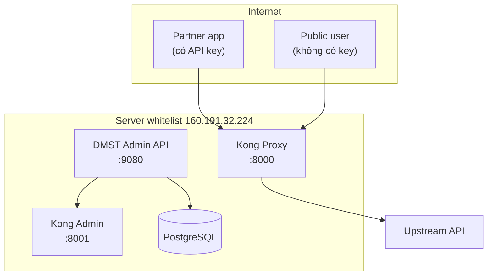

# Hướng dẫn demo publish API qua Kong bằng Postman Collection

> **Mục tiêu:** Dùng Postman Collection để demo bài toán publish một API nguồn chỉ cho phép truy cập từ server whitelist ra ngoài internet thông qua Kong Gateway, đồng thời thể hiện các chức năng quản trị đã có trong DMST Admin API.

---

## 1. Bài toán product

### Bối cảnh
- API nguồn chỉ cho phép truy cập từ server whitelist.
- Người dùng hoặc đối tác bên ngoài không thể gọi trực tiếp API nguồn.
- Cần một lớp trung gian để:
  - publish API ra ngoài internet
  - kiểm soát truy cập theo từng nhóm người dùng
  - quản trị tập trung qua Admin API thay vì cấu hình tay trên Kong

### 3 nhóm người dùng trong demo
- **Operator/Admin**: tạo cấu hình publish API và chính sách truy cập.
- **Partner tích hợp**: gọi endpoint có bảo vệ bằng API key.
- **Người dùng public**: gọi endpoint công khai.

### Kết quả mong muốn
Từ một upstream duy nhất, hệ thống publish thành 2 endpoint:
- **Public route**: không yêu cầu key; có gắn plugin `rate-limiting` giới hạn 5 request/phút.

---

## 2. Collection sử dụng

### File collection chính cho demo này
- `docs/develop/chiennb/postman/DMST-Kong-CDLQG-Demo.postman_collection.json`

### File collection cũ vẫn được giữ độc lập
- `docs/develop/chiennb/postman/DMST-Kong-Integration.postman_collection.json`

### Phạm vi collection mới đã cover
- health check
- private route create/list/detail
- tạo consumer
- cấp API key cho consumer
- gắn `key-auth` vào private route
- verify private proxy route không key → `401`
- verify private proxy route có key → `200`
- public route create
- attach `rate-limiting` kèm config chi tiết (minute=5, policy=local)
- verify public proxy route trả về `429` khi quá tải.
- update / history / rollback
- cleanup private/public route

### Giới hạn vẫn phải nói rõ
- Nhờ nâng cấp API Go, payload rate-limiting hiện đã hỗ trợ đầy đủ `config` block.
- Thử nghiệm rate limit 5 req/phút trực tiếp trên Kong thông qua API.

---

## 3. Kiến trúc tổng quan



---

## 4. Chuẩn bị Postman

## 4.1. Import collection
1. Chọn **Import** trong Postman.
2. Import file `docs/develop/chiennb/postman/DMST-Kong-CDLQG-Demo.postman_collection.json`.
3. Mở collection **DMST Kong CDLQG Demo**.

## 4.2. Collection variables mặc định

| Variable | Giá trị mặc định |
|---|---|
| `admin_api_base_url` | `http://160.191.32.224:9080` |
| `kong_proxy_url` | `http://160.191.32.224:8000` |
| `kong_admin_url` | `http://160.191.32.224:8001` |
| `private_route_config_id` | rỗng |
| `public_route_config_id` | rỗng |
| `consumer_id` | rỗng |
| `partner_api_key` | `cdlqg-secret-key-2026` |

## 4.3. Pre-flight checklist
- Admin API đang chạy.
- Kong Proxy đang chạy.
- Kong Admin đang chạy.
- Admin API kết nối được PostgreSQL.
- Upstream CDLQG còn reachable từ server whitelist.
- Các bảng `kong_route_configs`, `kong_route_config_history`, `kong_consumers`, `kong_consumer_keys`, `kong_route_plugins` đã tồn tại.

---

## 5. Mapping giữa collection và chức năng demo

| Folder / Request trong Postman | Mục đích |
|---|---|
| `0. Health Check / Check Admin API Health` | kiểm tra admin API còn sống |
| `1. Private Route Management / Create Private Route Config` | tạo private route CDLQG |
| `1. Private Route Management / List Route Configs` | xem danh sách route config |
| `1. Private Route Management / Get Private Route Detail` | xem chi tiết private route |
| `2. Consumer and Key / Create Consumer` | tạo consumer |
| `2. Consumer and Key / Assign API Key to Consumer` | cấp API key |
| `2. Consumer and Key / Enable key-auth on Private Route` | gắn key-auth |
| `3. Proxy Verification - Private / Call Private Proxy WITHOUT API Key` | verify `401` |
| `3. Proxy Verification - Private / Call Private Proxy WITH API Key` | verify `200` |
| `4. Public Route Management / Create Public Route Config` | tạo public route CDLQG |
| `4. Public Route Management / Enable rate-limiting on Public Route` | gắn plugin rate limit 5 req/phút |
| `4. Public Route Management / Call Public Proxy` | verify proxy hoạt động |
| `4. Public Route Management / Call Public Proxy (Rate Limit 429 Test)` | verify chặn 429 |
| `5. Update, History, Rollback / Update Public Route Config` | cập nhật upstream |
| `5. Update, History, Rollback / Get Public Route History` | xem history |
| `5. Update, History, Rollback / Rollback Public Route Config` | rollback |
| `6. Cleanup / Delete Private Route Config` | xóa private route |
| `6. Cleanup / Delete Public Route Config` | xóa public route |

---

## 6. Chạy demo private route bằng collection

## 6.1. Bước 1 — Health check
Chạy request:
- `0. Health Check / Check Admin API Health`

### Kỳ vọng
- HTTP `200`

---

## 6.2. Bước 2 — Tạo private route config
Chạy request:
- `1. Private Route Management / Create Private Route Config`

### Body đã khớp CDLQG sẵn
```json
{
  "system_code": "CDLQG",
  "action_code": "TIMKIEM_DULIEU",
  "version": "v1",
  "app": "integration",
  "upstream_url": "https://congdlqg.devlead.top/api/nguoidan/ud-tap-du-lieu/tim-kiem",
  "strip_path": true
}
```

### Kỳ vọng
- HTTP `200` hoặc `201`
- script tự lưu `private_route_config_id`

---

## 6.3. Bước 3 — Xem list và detail
Chạy lần lượt:
- `1. Private Route Management / List Route Configs`
- `1. Private Route Management / Get Private Route Detail`

### Cần kiểm tra
- `route_path = /api/v1/integration/CDLQG/TIMKIEM_DULIEU`
- `status = ACTIVE`
- có Kong IDs

---

## 6.4. Bước 4 — Tạo consumer và cấp API key
Chạy lần lượt:
- `2. Consumer and Key / Create Consumer`
- `2. Consumer and Key / Assign API Key to Consumer`

### Kỳ vọng
- script tự lưu `consumer_id`
- key được tạo thành công

---

## 6.5. Bước 5 — Gắn `key-auth`
Chạy request:
- `2. Consumer and Key / Enable key-auth on Private Route`

---

## 6.6. Bước 6 — Verify private proxy
Chạy lần lượt:
- `3. Proxy Verification - Private / Call Private Proxy WITHOUT API Key`
- `3. Proxy Verification - Private / Call Private Proxy WITH API Key`

### Kỳ vọng
- request không key → `401`
- request có key → `200`

---

## 7. Chạy demo public route bằng collection

## 7.1. Bước 1 — Tạo public route config
Chạy request:
- `4. Public Route Management / Create Public Route Config`

### Body đã khớp CDLQG sẵn
```json
{
  "system_code": "CDLQG",
  "action_code": "TIMKIEM_DULIEU",
  "version": "v2",
  "app": "public",
  "upstream_url": "https://congdlqg.devlead.top/api/nguoidan/ud-tap-du-lieu/tim-kiem",
  "strip_path": true
}
```

### Kỳ vọng
- HTTP `200` hoặc `201`
- script tự lưu `public_route_config_id`

---

### Payload JSON đầy đủ:
```json
{
  "plugin_name": "rate-limiting",
  "config": {
    "minute": 5,
    "policy": "local"
  }
}
```
Cấu hình này đảm bảo Kong sẽ tự động bóp băng thông xuống 5 request/phút cho route này.

---

## 7.3. Bước 3 — Verify public proxy
Chạy request:
- `4. Public Route Management / Call Public Proxy`

### Kỳ vọng tối thiểu
- `200 OK`

---

## 8. Update, history, rollback, cleanup

Chạy lần lượt:
- `5. Update, History, Rollback / Update Public Route Config`
- `5. Update, History, Rollback / Get Public Route History`
- `5. Update, History, Rollback / Rollback Public Route Config`
- `6. Cleanup / Delete Private Route Config`
- `6. Cleanup / Delete Public Route Config`

---

## 9. Verification matrix

| Kịch bản | Collection mới |
|---|---|
| Health check | Có |
| Create private route CDLQG | Có |
| List route configs | Có |
| Get private route detail | Có |
| Create consumer | Có |
| Assign API key | Có |
| Enable `key-auth` | Có |
| Private proxy không key → `401` | Có |
| Private proxy có key → `200` | Có |
| Create public route CDLQG | Có |
| Attach `rate-limiting` kèm config | Có |
| Public proxy cơ bản | Có |
| Verify `429` với ngưỡng cụ thể | Có |

---

## 10. Lỗi thường gặp

### 10.1. `private_route_config_id` hoặc `public_route_config_id` không được set
- request create fail
- response không có field `id`
- response không phải JSON hợp lệ

### 10.2. `consumer_id` không được set
Collection đã hỗ trợ đọc cả `ID` và `id`, nhưng vẫn cần kiểm tra response thực tế nếu create consumer fail.

### 10.3. Public route không trả `429`
- chưa xác nhận policy thật trên Kong
- admin API hiện chỉ chắc phần attach `plugin_name`
- chưa nên dùng làm bằng chứng cuối cùng cho config rate-limit chi tiết

---

## 11. Kết luận

Phiên bản tài liệu này dùng collection mới độc lập, khớp trực tiếp với flow CDLQG và không phụ thuộc vào collection cũ. Collection cũ vẫn được giữ riêng làm artifact tham chiếu lịch sử.