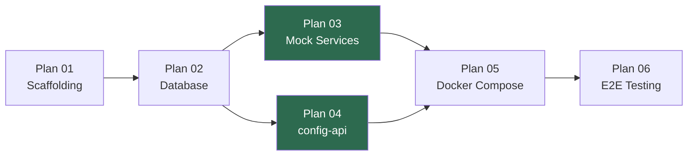

# 📋 Kong POC — Sub-Plans Index

> Breakdown từ [plan_main.md](file:///d:/Workspace/GTSC2026/26.dmst.c12.tichhopchiase/docs/kong/plans/plan_main.md)

---

## Execution Order & Dependencies

> **Plan 03 và Plan 04 chạy song song.** Mocks không phụ thuộc config-api.

---

## Plans Overview

| # | Plan | Phase | Tasks | Dependencies | Trạng thái |
|---|------|-------|-------|-------------|------------|
| 01 | [Scaffolding](file:///d:/Workspace/GTSC2026/26.dmst.c12.tichhopchiase/docs/kong/plans/plan_01_scaffolding.md) | Phase 0 | 9 | Không | ⬜ Chưa bắt đầu |
| 02 | [Database](file:///d:/Workspace/GTSC2026/26.dmst.c12.tichhopchiase/docs/kong/plans/plan_02_database.md) | Phase 1 | 4 | Plan 01 | ⬜ Chưa bắt đầu |
| 03 | [Mock Services](file:///d:/Workspace/GTSC2026/26.dmst.c12.tichhopchiase/docs/kong/plans/plan_03_mock_services.md) | Phase 3 | 18 | Plan 01, 02 | ⬜ Chưa bắt đầu |
| 04 | [config-api](file:///d:/Workspace/GTSC2026/26.dmst.c12.tichhopchiase/docs/kong/plans/plan_04_config_api.md) | Phase 2 | 22 | Plan 01, 02 | ⬜ Chưa bắt đầu |
| 05 | [Docker Compose](file:///d:/Workspace/GTSC2026/26.dmst.c12.tichhopchiase/docs/kong/plans/plan_05_docker_compose.md) | Phase 4 | 10 | Plan 03, 04 | ⬜ Chưa bắt đầu |
| 06 | [E2E Testing](file:///d:/Workspace/GTSC2026/26.dmst.c12.tichhopchiase/docs/kong/plans/plan_06_e2e_testing.md) | Phase 5 | 7 scenarios | Plan 05 | ⬜ Chưa bắt đầu |

**Tổng:** ~70 tasks, 27 files cần tạo

---

## Quy ước trạng thái

| Icon | Trạng thái |
|------|-----------|
| ⬜ | Chưa bắt đầu |
| 🔄 | Đang thực hiện |
| ✅ | Hoàn thành |
| ⚠️ | Có vấn đề cần xử lý |

---

## Ràng buộc chung

> [!CAUTION]
> - **KHÔNG** chỉnh sửa `srcs/adm-srv-go-api/**`
> - **KHÔNG** chỉnh sửa `docs/kong/brainstorm*.md`
> - Toàn bộ code POC nằm trong `srcs/poc-kong-integration/`
