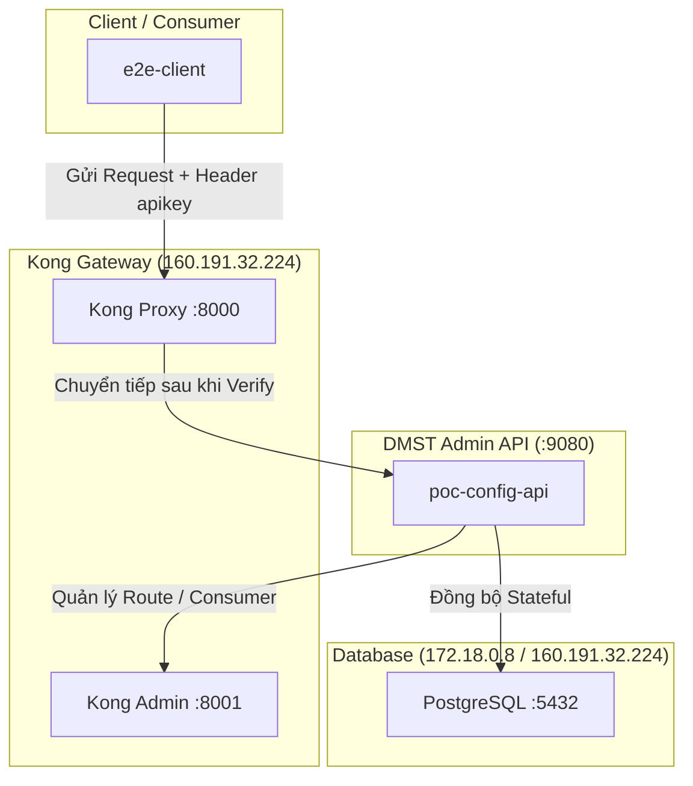

# PLAN: POC Kong Integration (Updated)

🚨 **TRẠNG THÁI: ĐÃ HOÀN THÀNH & TÍCH HỢP TOÀN DIỆN**

> **Ghi chú:** Toàn bộ phạm vi POC ban đầu (trong thư mục `srcs/poc-kong-integration/`) hiện tại đã được sáp nhập trực tiếp vào dự án monolith chính **`srcs/dmst-admin-api/`**.

---

## Kiến trúc Hiện tại

## Các tính năng đã được kiểm chứng (Definition of Done)

1. **Quản lý Route Configs**: Đầy đủ 8 REST Endpoints quản lý đồng bộ trạng thái giữa Postgres và Kong.
2. **Quản lý Kong Auth Stateful**:
    - Tạo Consumer và tự động map tới Kong ID.
    - Cấp phát API Key bí mật cho Consumer.
    - Đính kèm/Tháo gỡ plugin `key-auth` trực tiếp trên Route đang chạy.
3. **Upsert Fallback Mechanism**: Tự động chuyển đổi `POST` -> `PATCH` khi đồng bộ bị trùng lặp Service/Route trên Kong.

## Các tài liệu kế hoạch mở rộng đã thực thi
- [PLAN-kong-auth-consumer.md](PLAN-kong-auth-consumer.md) (Auth Flow)
- [PLAN-kong-upsert.md](PLAN-kong-upsert.md) (Upsert Logic)
