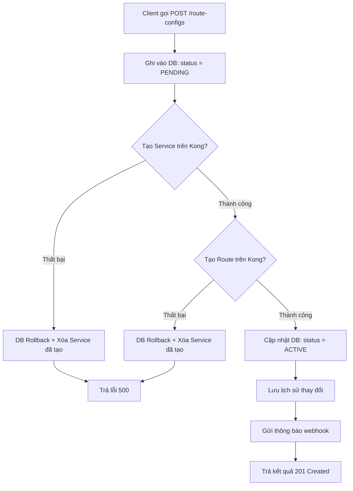
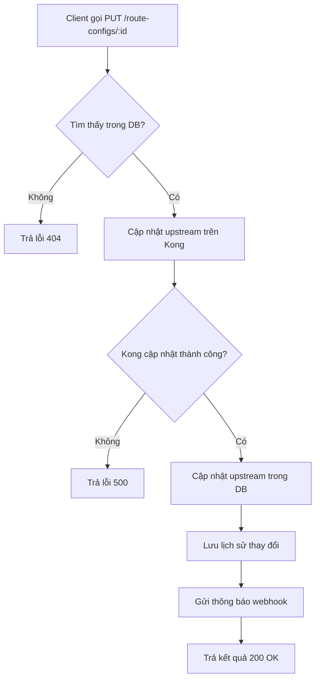
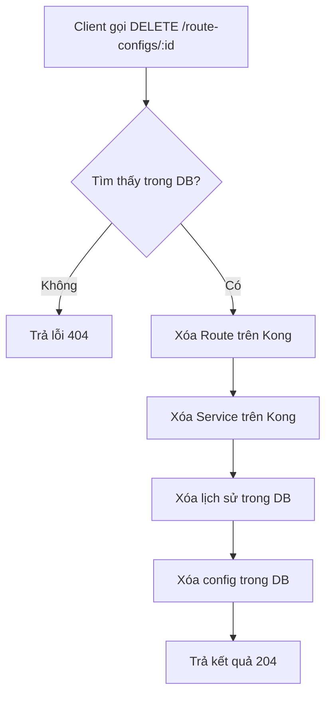
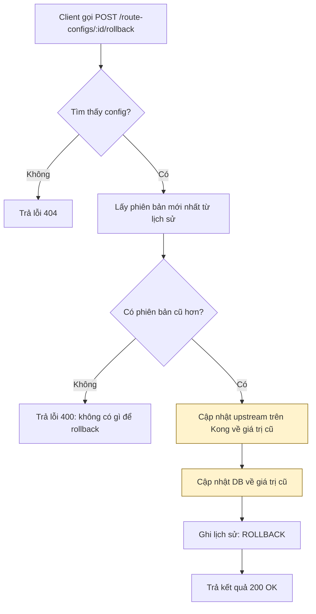
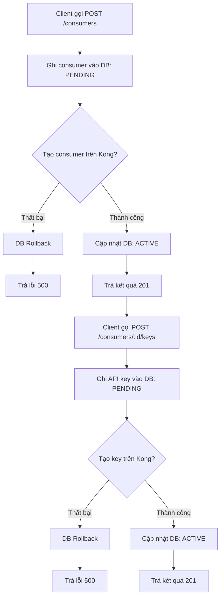
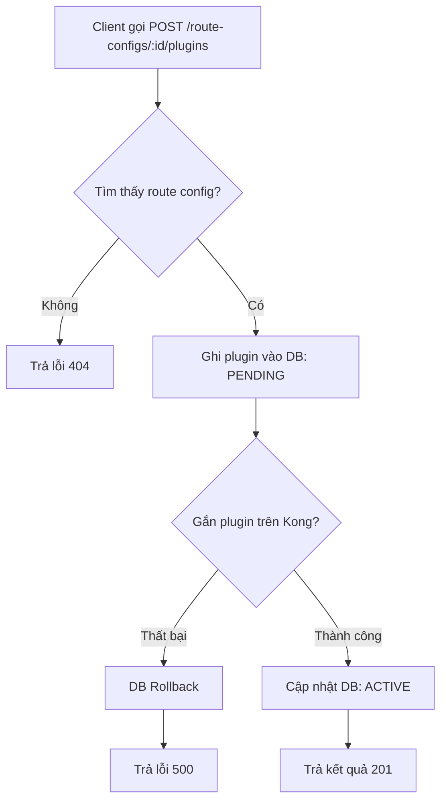

# Luồng xử lý DB-First — Kong Integration

> Nguyên tắc chung: **Ghi DB trước → Gọi Kong sau → Cập nhật trạng thái**
> Nếu Kong lỗi → DB tự động rollback, không để dữ liệu lệch.

---

## 1. Tạo Route Config mới

---

## 2. Cập nhật Route Config

---

## 3. Xóa Route Config

---

## 4. Rollback Route Config

> **Lưu ý:** Rollback hiện tại chỉ khôi phục `upstream_url`. Không khôi phục plugin, consumer hay API key.

---

## 5. Tạo Consumer và cấp API Key

---

## 6. Gắn Plugin vào Route

---

## Tổng hợp

| Chức năng | Lưu DB | Đồng bộ Kong | Tự rollback khi lỗi | Lịch sử thay đổi | Rollback thủ công | Khôi phục DB → Kong |
|---|:---:|:---:|:---:|:---:|:---:|:---:|
| Route Config | ✅ | ✅ | ✅ | ✅ | ⚠️ chỉ upstream | ❌ |
| Consumer | ✅ | ✅ | ✅ | ❌ | ❌ | ❌ |
| API Key | ✅ | ✅ | ✅ | ❌ | ❌ | ❌ |
| Plugin | ✅ | ✅ | ✅ | ❌ | ❌ | ❌ |
