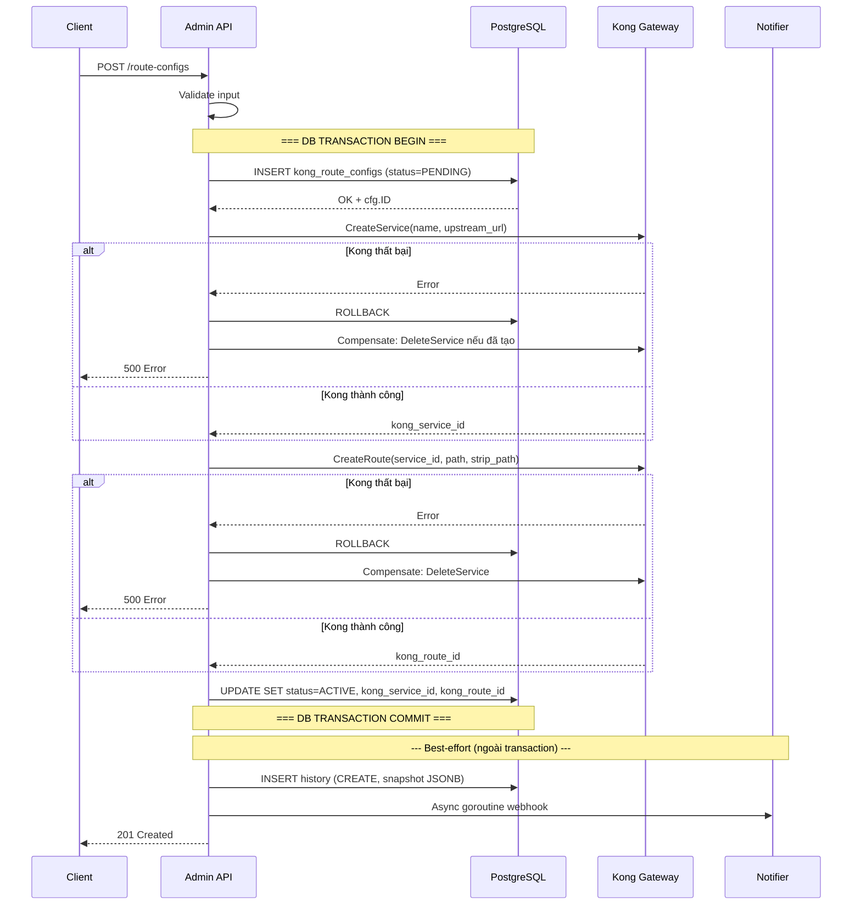
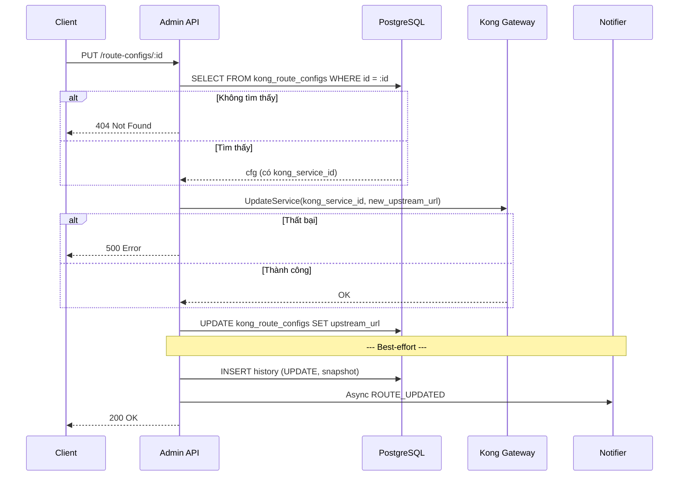
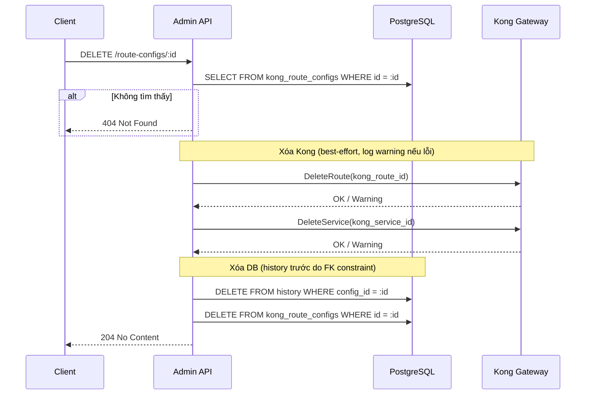
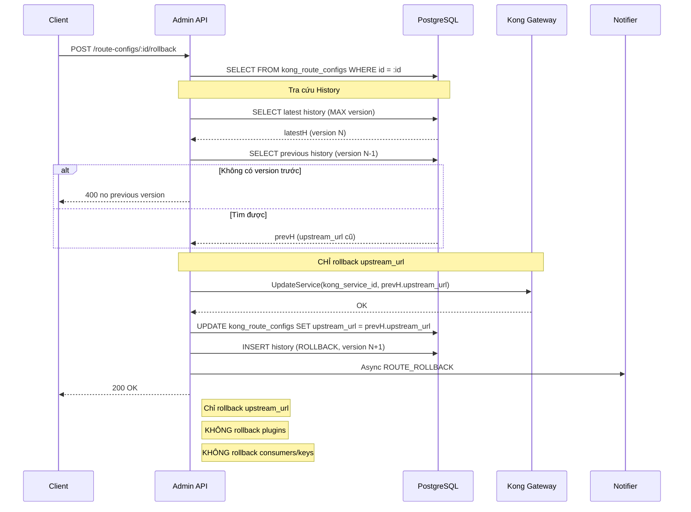
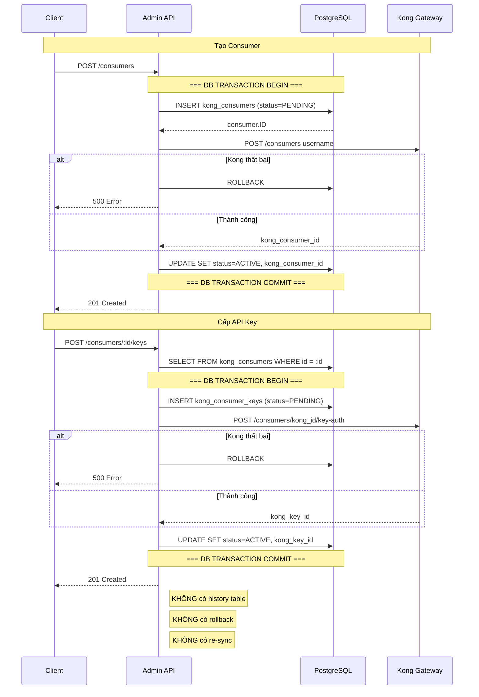
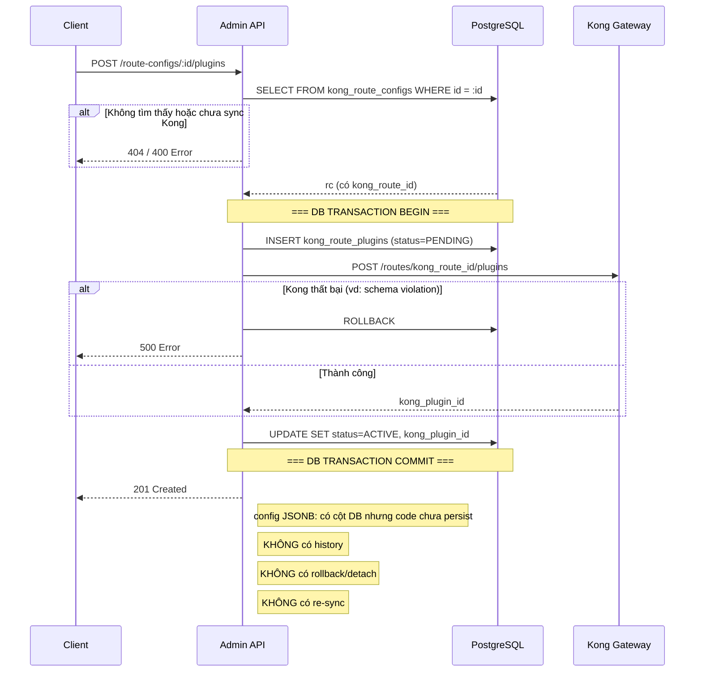

# Biểu đồ hoạt động DB-First — Kong Integration

## 1. CreateRouteConfig

---

## 2. UpdateRouteConfig

---

## 3. DeleteRouteConfig

---

## 4. RollbackRouteConfig

---

## 5. CreateConsumer + CreateConsumerKey

---

## 6. AddPluginToRoute

---

## Tổng hợp trạng thái hỗ trợ

| Chức năng | DB local | Kong ID | Transaction | History | Rollback | Re-sync |
|---|:---:|:---:|:---:|:---:|:---:|:---:|
| Route Config | ✅ | ✅ | ✅ | ✅ | ⚠️ upstream only | ❌ |
| Consumer | ✅ | ✅ | ✅ | ❌ | ❌ | ❌ |
| Consumer Key | ✅ | ✅ | ✅ | ❌ | ❌ | ❌ |
| Plugin | ✅ | ✅ | ✅ | ❌ | ❌ | ❌ |
| Plugin config | ⚠️ cột có, chưa lưu | — | — | ❌ | ❌ | ❌ |
