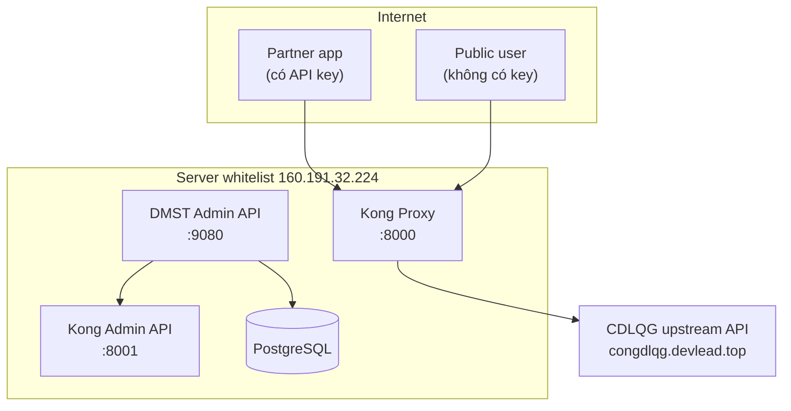
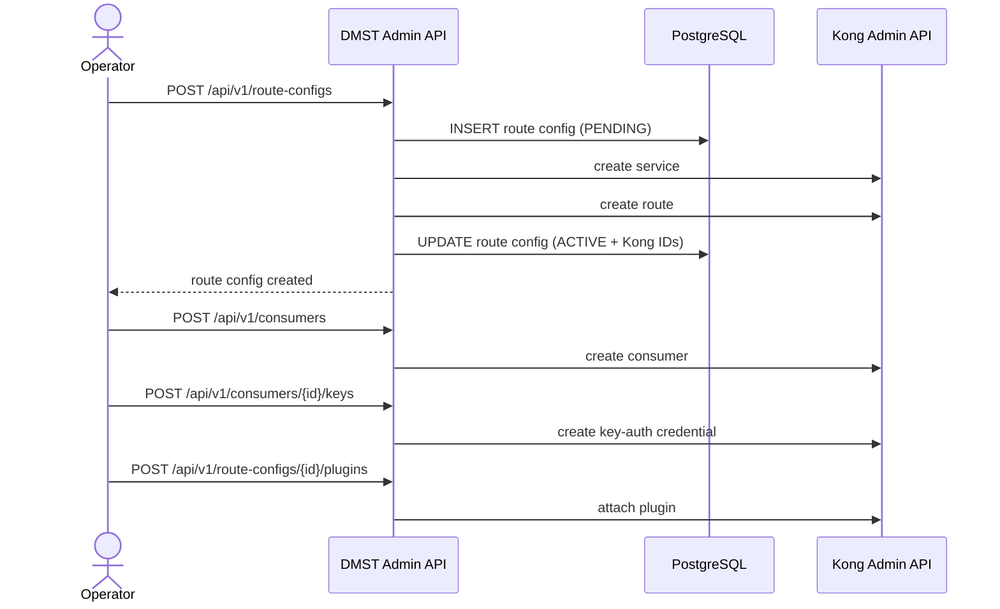
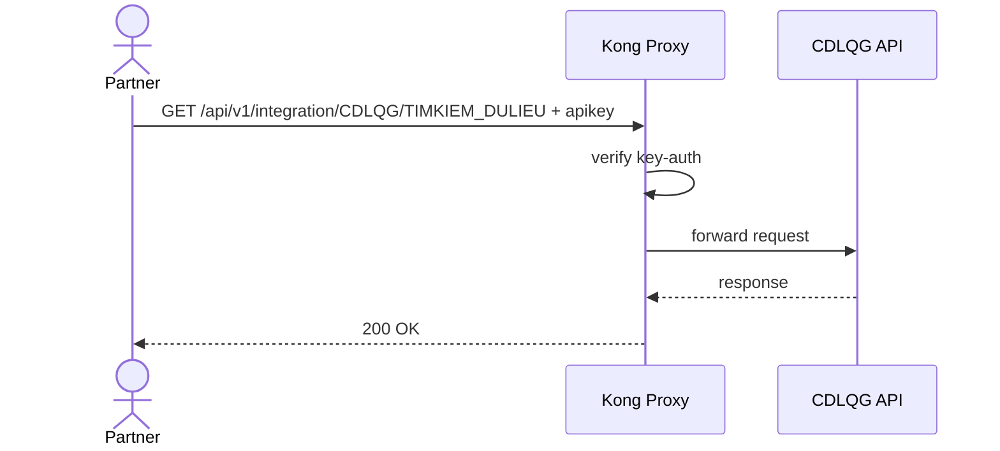
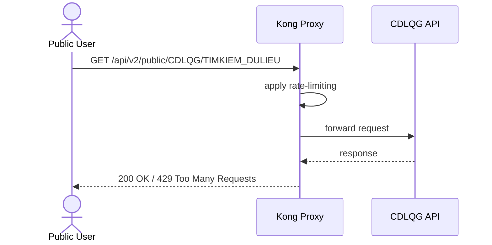

# Slide 1 — Bài toán tích hợp chia sẻ dữ liệu

## Vì sao cần Kong Gateway?
- API nguồn CDLQG chỉ cho phép truy cập từ server whitelist.
- Người dùng/đối tác bên ngoài không gọi trực tiếp được.
- Nếu publish thủ công sẽ khó quản trị, khó kiểm soát truy cập, khó audit.

## Mục tiêu
- mở API ra ngoài internet qua lớp proxy trung gian
- áp chính sách truy cập khác nhau cho từng nhóm người dùng
- quản trị tập trung qua DMST Admin API

## Thông điệp chính
**Kong là lớp gateway thực thi. DMST Admin API là lớp quản trị cấu hình.**

---

# Slide 2 — Các actor trong bài toán

## 3 nhóm actor
1. **Operator/Admin**
   - tạo route config
   - gắn plugin
   - quản lý lifecycle publish API
2. **Partner tích hợp**
   - gọi private route có API key
3. **Người dùng public**
   - gọi public route, bị giới hạn lưu lượng

## Ý nghĩa
Cùng một upstream nhưng phục vụ nhiều nhóm người dùng với chính sách khác nhau.

---

# Slide 3 — Kiến trúc tổng quan



## Ý chính
- Admin API quản trị cấu hình.
- Kong Proxy phục vụ request runtime.
- PostgreSQL lưu metadata, trạng thái, history.

---

# Slide 4 — Phân tách vai trò giữa Admin API và Kong

## DMST Admin API làm gì?
- nhận request quản trị
- tạo route config
- tạo consumer / API key
- lưu DB state
- gọi Kong Admin API để apply config
- hỗ trợ update / history / rollback / delete

## Kong Gateway làm gì?
- route request tới upstream
- xác thực API key
- áp rate limiting
- trả response cho caller

## Giá trị kiến trúc
**Tách lớp control plane và data plane.**

---

# Slide 5 — Luồng quản trị publish API



## Ý chính
Route không được cấu hình tay trên Kong. Mọi thay đổi đi qua Admin API.

---

# Slide 6 — Quy tắc sinh route path

## Công thức
```text
/api/{version}/{app}/{SYSTEM_CODE}/{ACTION_CODE}
```

## Ví dụ thực tế
- Private route:
  - `/api/v1/integration/CDLQG/TIMKIEM_DULIEU`
- Public route:
  - `/api/v2/public/CDLQG/TIMKIEM_DULIEU`

## Ý nghĩa
- dễ chuẩn hóa naming
- dễ suy luận endpoint từ nghiệp vụ
- cùng upstream nhưng có thể publish nhiều route khác nhau

---

# Slide 7 — Luồng runtime private route



## Kết quả mong đợi
- không có key → `401`
- có key đúng → `200`

## Ý nghĩa product
Route này dành cho đối tác tích hợp chính thức.

---

# Slide 8 — Luồng runtime public route



## Kết quả mong đợi
- trong ngưỡng → `200`
- vượt ngưỡng → `429`

## Ý nghĩa product
Mở public nhưng vẫn bảo vệ upstream khỏi lạm dụng.

---

# Slide 9 — Năng lực quản trị đã có trong hệ thống

## Route lifecycle
- create route config
- list route configs
- get detail
- update upstream
- history
- rollback
- delete

## Auth lifecycle
- create consumer
- assign API key
- attach `key-auth`

## Operational benefit
- có trace lịch sử
- rollback khi cấu hình sai
- không phụ thuộc thao tác tay trên Kong

---

# Slide 10 — Kết luận và thông điệp cho team

## Hệ thống đang giải quyết gì?
- publish API whitelist-only ra ngoài internet
- tách chính sách truy cập theo từng nhóm user
- quản trị tập trung, có history, có rollback

## Logic cốt lõi
- **Admin API = control plane**
- **Kong Gateway = enforcement/runtime plane**
- **1 upstream -> nhiều endpoint -> nhiều policy**

## Điều cần nhớ
- private route cho partner có API key
- public route cho chia sẻ mở có rate limit
- mọi thay đổi nên đi qua Admin API để đảm bảo quản trị và audit
