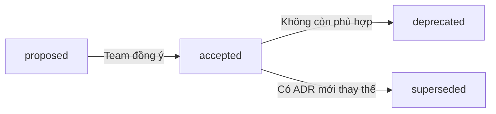

# ADR Template

Sử dụng template này khi team cần ghi nhận một quyết định kiến trúc, thử nghiệm pattern mới, hoặc nâng cấp công nghệ.

## Khi nào tạo ADR?

- Chọn pattern mới (ví dụ: Feature Slice thay vì Monolith)
- Thêm/thay thế thư viện quan trọng
- Thay đổi quy trình (build, deploy, testing)
- Thử nghiệm approach mới cho một vấn đề

## Template

```markdown
# ADR-XXXX: [Tiêu đề ngắn gọn]

- **Status**: proposed | accepted | deprecated | superseded by ADR-YYYY
- **Date**: YYYY-MM-DD
- **Deciders**: [Tên người quyết định]

## Context

[Mô tả bối cảnh và vấn đề cần giải quyết. Tại sao cần đưa ra quyết định này?]

## Decision

[Quyết định đã chọn là gì? Giải thích rõ ràng approach.]

## Alternatives Considered

[Các phương án khác đã cân nhắc và tại sao không chọn.]

## Consequences

### Positive
- [Lợi ích]

### Negative
- [Trade-offs]

### Risks
- [Rủi ro tiềm ẩn]
```

## ADR Lifecycle



## Naming Convention

File: `docs/adr/XXXX-short-description.md`

Ví dụ:
- `0001-feature-slice-layout.md`
- `0002-zustand-over-redux.md`
- `0003-docusaurus-for-docs.md`
