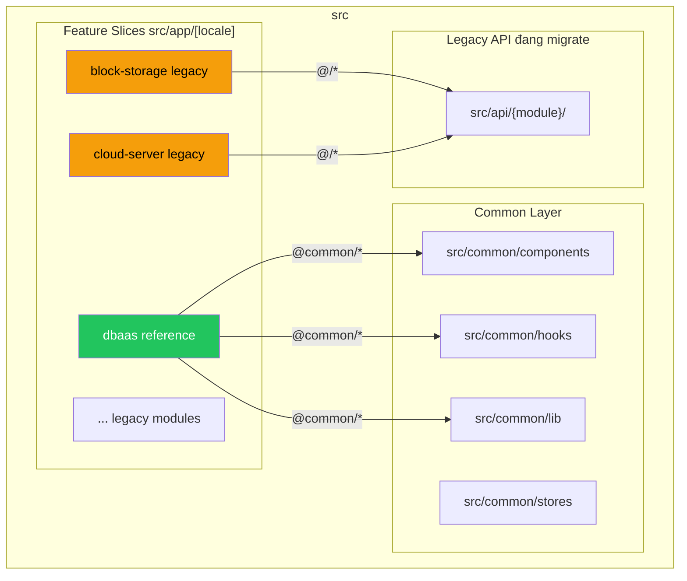
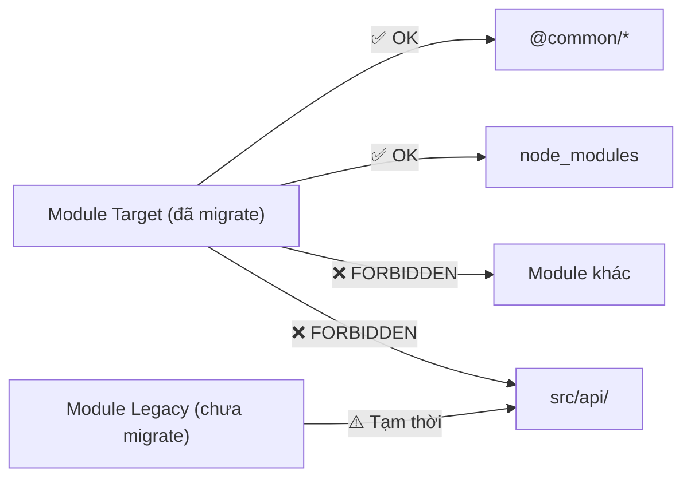

# Tổng quan Kiến trúc

Dự án sử dụng kiến trúc **Feature Slice** trên nền **Next.js App Router**, chia thành 2 lớp chính.

## Vì sao DBaaS là reference cho người mới?

- DBaaS là module đã migrate đầy đủ theo kiến trúc mục tiêu (`_apis`, `_lib`, `_stores`, route schemas colocated).
- Các module legacy vẫn tồn tại để đảm bảo vận hành, nhưng không phản ánh chuẩn code mới.
- Khi bắt đầu feature mới, học từ DBaaS giúp tránh copy nhầm pattern cũ và giảm refactor về sau.

## Sơ đồ Kiến trúc



## Hai lớp chính

### 1. Common Layer (`src/common/`)

Code dùng chung cho toàn bộ ứng dụng. Import qua alias `@common/*`.

```
src/common/
├── components/       # UI components (shadcn/ui, layout, containers)
│   ├── ui/          # shadcn/ui primitives (Button, Dialog, Input...)
│   ├── layout/      # App layout (Sidebar, Breadcrumb, Navigation)
│   ├── containers/  # Smart containers (forms, tables, dialogs)
│   └── icons/       # SVG icon components
├── hooks/           # Shared React hooks
├── lib/             # Utilities
│   ├── core/        # Domain core (routes, auth, permissions)
│   ├── helpers/     # Pure utility functions
│   └── feature-flags/
└── stores/          # Shared Zustand stores & StoreProvider
```

→ Xem chi tiết: [Common Layer](./common-layer.md)

### 2. Feature Slices (`src/app/[locale]/{module}/`)

Mỗi module là một "mini-project" độc lập, chứa toàn bộ logic cần thiết bên trong.

| Module | Trạng thái | Cấu trúc |
|--------|-----------|-----------|
| `dbaas` | ✅ **Reference** | `_apis/`, `_lib/`, `_hooks/`, `_stores/` |
| `block-storage` | ⚠️ Legacy | `_actions/`, `_utils/`, API ở `src/api/` |
| `cloud-server` | ⚠️ Legacy | `_actions/`, `_utils/`, API ở `src/api/` |
| `file-storage` | 🔄 Partial | `_apis/` partial, restcòn legacy |
| ... | | |

→ Xem chi tiết: [Giải phẫu Module Chuẩn](./module-anatomy.md)

## Quy tắc Import Boundary



| Từ | Đến | Cho phép? |
|----|-----|-----------|
| Module | `@common/*` | ✅ Luôn OK |
| Module | `node_modules` | ✅ Luôn OK |
| Module | Module khác | ❌ **Cấm** — extract shared code vào `@common/*` |
| Module target (đã migrate) | `src/api/{module}/` | ❌ **Cấm** — API phải nằm trong `_apis/` |
| Module legacy (chưa migrate) | `src/api/{module}/` | ⚠️ Tạm thời cho phép trong giai đoạn migrate |

## Path Aliases

Cấu hình trong `tsconfig.json`:

```json
{
  "paths": {
    "@/*": ["./src/*"],
    "@common/*": ["./src/common/*"],
    "@dbaas/*": ["./src/app/[locale]/dbaas/*"]
  }
}
```

Khi module migrate hoàn chỉnh và cần import boundary rõ hơn, có thể thêm alias riêng (ví dụ: `@kms/*`, `@network/*`).

## Legacy vs Target

| Khía cạnh | Legacy (chưa migrate) | Target (DBaaS) |
|-----------|----------------------|-------------------|
| API layer | `src/api/{module}/` | `{module}/_apis/` |
| Business logic | `_utils/utils.ts` | `_lib/helpers.ts` |
| Validation | Nằm trong `const.ts` | `_lib/validators.ts` + route `schemas.ts` |
| Permissions | `_actions/allowed-actions.ts` | `_apis/urns.ts` |
| State | `_providers/` | `_stores/` |
| Import style | `@/api/{module}`, `@/app/[locale]/...` | `@{module}/*` |

## Tech Stack

| Công nghệ | Vai trò |
|-----------|---------|
| **Next.js 14** (App Router) | Framework |
| **TypeScript** (strict) | Ngôn ngữ |
| **Tailwind CSS** + **shadcn/ui** | UI / Styling |
| **Zustand** | Client state management |
| **React Hook Form** + **Zod** | Forms & validation |
| **Vitest** | Testing |
| **Storybook** | Component documentation |

## Bước tiếp theo

1. Đọc [Giải phẫu Module Chuẩn](./module-anatomy.md) để nắm cấu trúc thực thi chi tiết.
2. Đọc [Migration status](./migration-status.md) để biết module nào nên tránh dùng làm mẫu.
3. Nếu cần tìm code nhanh, đọc [How to find code](../handbook/how-to-find-code.md).
