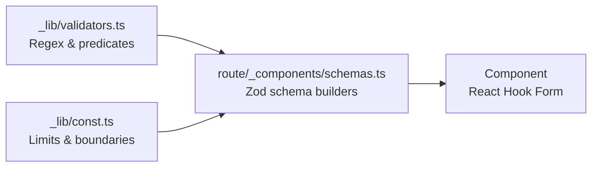

# Form & Validation

Dự án sử dụng **React Hook Form** + **Zod** cho tất cả forms. Validation logic được tách thành 2 layer.

## Kiến trúc Validation



| Layer | File | Chứa |
|-------|------|------|
| **Validators** | `_lib/validators.ts` | Regex patterns, predicate functions |
| **Constants** | `_lib/const.ts` | Min/max values, UI limits |
| **Schemas** | `{route}/_components/schemas.ts` | Zod schema builders, colocated với route |

## `validators.ts` — Regex & Predicates

Tập trung tất cả regex và validation functions. **Không đặt** trong `const.ts`.

```typescript
// _lib/validators.ts
export const BACKUP_NAME_REGEX = /^(?=.*[a-zA-Z0-9])[a-zA-Z0-9 _-]+$/;
export const HAS_UPPERCASE_REGEX = /[A-Z]/;
export const HAS_LOWERCASE_REGEX = /[a-z]/;
export const HAS_NUMBER_REGEX = /\d/;

export function isValidRootPassword(value: string): boolean {
  return (
    !value.includes("@") &&
    HAS_LOWERCASE_REGEX.test(value) &&
    HAS_UPPERCASE_REGEX.test(value) &&
    HAS_NUMBER_REGEX.test(value)
  );
}
```

## `schemas.ts` — Zod Schema Builders

Schemas nằm **cạnh route** sử dụng chúng:

```typescript
// instances/_components/schemas.ts
import { MIN_DISK_SIZE, MAX_DISK_SIZE } from "@dbaas/_lib/const";
import { isValidRootPassword } from "@dbaas/_lib/validators";
import type { DBInstance } from "@dbaas/_apis/types";
import z from "zod";

export function getExtendDiskSizeSchema(record: DBInstance) {
  return z.object({
    newSize: z.number()
      .min(MIN_DISK_SIZE, { message: "Disk size too small" })
      .max(MAX_DISK_SIZE, { message: "Disk size too large" })
      .refine((value) => value * 10 > record.diskSize, {
        message: "New size must be larger than current",
      }),
  });
}
```

:::important
**Schema builder là function**, không phải object — vì cần nhận dynamic data (như `record`).
:::

## React Hook Form Integration

```tsx
"use client";

import { useForm } from "react-hook-form";
import { zodResolver } from "@hookform/resolvers/zod";
import { getExtendDiskSizeSchema } from "./schemas";

function ExtendDiskSizeDialog({ record }: { record: DBInstance }) {
  const schema = getExtendDiskSizeSchema(record);

  const form = useForm({
    resolver: zodResolver(schema),
    defaultValues: { newSize: record.diskSize },
  });

  const onSubmit = form.handleSubmit(async (data) => {
    await extendVolumeSize(record.id, { newSize: data.newSize });
  });

  return (
    <form onSubmit={onSubmit}>
      {/* form fields */}
    </form>
  );
}
```

## Testing

### `validators.test.ts`

```typescript
import { isValidRootPassword, BACKUP_NAME_REGEX } from "./validators";

describe("isValidRootPassword", () => {
  it("accepts valid password", () => {
    expect(isValidRootPassword("Abc123!@")).toBe(true);
  });

  it("rejects password with @", () => {
    expect(isValidRootPassword("Abc@123!")).toBe(false);
  });
});
```

### `schemas.test.ts`

```typescript
import { getExtendDiskSizeSchema } from "./schemas";

const mockRecord = { diskSize: 100 } as DBInstance;

describe("getExtendDiskSizeSchema", () => {
  const schema = getExtendDiskSizeSchema(mockRecord);

  it("accepts valid size", () => {
    expect(schema.safeParse({ newSize: 20 }).success).toBe(true);
  });

  it("rejects size smaller than current", () => {
    expect(schema.safeParse({ newSize: 5 }).success).toBe(false);
  });
});
```
