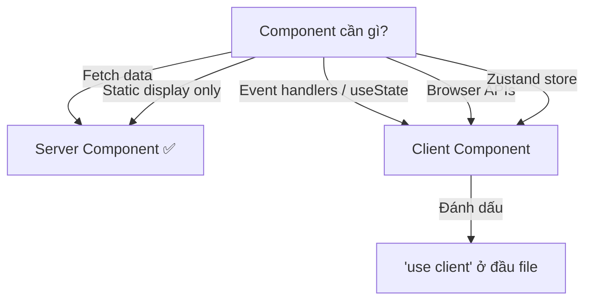

# State Management

## Tổng quan

| Loại state | Giải pháp | Ví dụ |
|-----------|----------|-------|
| Server data | Server Components + fetch | Danh sách instances, detail page |
| Module-scoped client state | Zustand trong `_stores/` | Instance info shared across tabs |
| Global app state | Zustand trong `@common/stores/` | Theme, user session |
| Form state | React Hook Form | Create/edit forms |
| URL state | `searchParams` | Pagination, filters, active tab |

## Zustand Stores

### Module-scoped Store

Dùng `createStoreContext` từ `@common/stores/StoreProvider`:

```typescript
// _stores/DBaaSStoreProvider.tsx
"use client";

import type { DBInstance } from "@dbaas/_apis/types";
import { createStore } from "zustand";
import { createStoreContext } from "@common/stores/StoreProvider";

type DBInstanceState = {
  DBInstanceInfo: DBInstance;
};

const createDbaasStore = (initState: DBInstanceState) =>
  createStore<DBInstanceState>()(() => ({
    ...initState,
  }));

export const {
  StoreProvider: DbaasStoreProvider,
  useStoreContext: useDbaasStore,
} = createStoreContext<DBInstanceState>(createDbaasStore);
```

### Sử dụng trong Layout

```tsx
// instances/[instanceId]/layout.tsx
import { DbaasStoreProvider } from "@dbaas/_stores/DBaaSStoreProvider";

export default async function InstanceLayout({ children, params }) {
  const instanceInfo = await getDBInstanceInfo(params.instanceId);

  return (
    <DbaasStoreProvider initState={{ DBInstanceInfo: instanceInfo }}>
      {children}
    </DbaasStoreProvider>
  );
}
```

### Sử dụng trong Client Component

```tsx
"use client";
import { useDbaasStore } from "@dbaas/_stores/DBaaSStoreProvider";

function InstanceOverview() {
  const instance = useDbaasStore((state) => state.DBInstanceInfo);
  return <h1>{instance.name}</h1>;
}
```

## Server vs Client Components

### Decision Tree



:::tip
**Mặc định là Server Component.** Chỉ thêm `"use client"` khi thực sự cần interactivity.
:::

## Quy tắc

- `_stores/` chứa **Zustand** và **client state phạm vi module** — không nhét state chỉ dùng một lần tại một route (ưu tiên local/`useState`) và không cần share vào store.
- Shared stores (theme, auth) nằm trong `@common/stores/`.
- **`_providers/`** — dùng cho **composition tại layout module**: bọc `NextIntlClientProvider`, billing guard, `StoreProvider` của Zustand, preload dùng chung, v.v. (ví dụ `CloudServerProvider` trong [Component usage](../handbook/component-usage.md)). **Không** lấy `_providers/` làm chỗ nhét toàn bộ **state có `useXStore`** thay cho `_stores/`: *provider* = boundary React / context; *store* = Zustand và hook consume state.
- Tránh prop drilling — dùng store context khi data cần shared across nhiều components trong cùng subtree.
