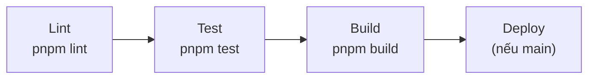

# CI/CD

## Pipeline Overview

CI chạy trên mỗi Merge Request và push lên `main`. Chi tiết công cụ lint và chất lượng code: [Lint & code quality](../guidelines/lint-and-quality.md).

### Stages



## Commands

| Stage | Command | Mô tả |
|-------|---------|-------|
| Lint | `pnpm lint` | Prettier check + ESLint |
| Test | `pnpm test` | Vitest run |
| Test Coverage | `pnpm test:coverage` | Vitest + coverage report |
| Build | `pnpm build` | Next.js production build |
| Typecheck | `pnpm exec tsc --noEmit` | TypeScript type checking |

## Docker Build

```bash
# Build image (tag = git short hash)
docker build -t app:$(git rev-parse --short=8 HEAD) .

# Run container
docker run --net host \
  --name app \
  --env-file ./.env \
  app:$(git rev-parse --short=8 HEAD)
```

## Release

Project sử dụng **semantic-release** cho auto versioning:

- Push lên `main` → semantic-release phân tích commit messages
- Tự động bump version, tạo tag, update changelog
- Commit types: `feat` → minor, `fix` → patch, `BREAKING CHANGE` → major
